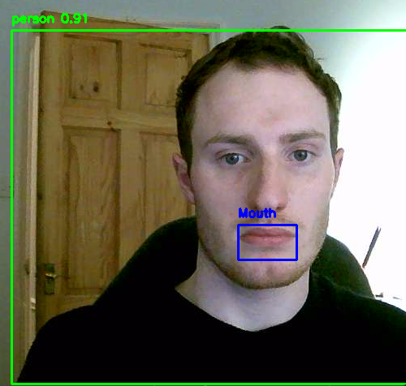
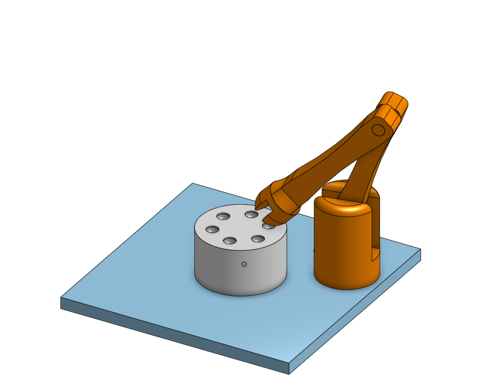

# Computer Vision and Human Machine Interaction

The goal of this report is to make a machine that is capable of feeding elderly and disabled people. it is compiresed of 2 parts:

- A Vision system that detects the person, their mouth and the food.
- A Robotic arm that feeds the person.

Aswell as their primary functions, there are some secondatry purposes that are also important:

    - The Vision system should be used for visual servoing of the robotic arm towards the user and food.
    - The soft end effector of the arm should use vision based tactile sensors to detect when it has a good grip on the food.
    - The robotic arm should have force limiting sensors on every joint to prevent injury to the user and mushing the food.

## Vision System

The Vision system is comprised of 3 main parts:

    - Person Detection
    - Mouth Detection
    - Food Detection

The Person and Food Detection are done using YOLOv8 that uses a pre-trained model to detect the person and food. The Mouth Detection is done using a Haar Cascade Classifier that is trained to detect the mouth.

Example:

[]

//TODO: Add image of food recognition

## Robotic Arm

The Robotic arm is a 6 DOF arm that is capable of feeding the person. It is comprised of 3 main parts:

    - The Robotic Arm
    - The End Effector
    - The Force Sensors

The Robotic arm picks food up from the rotating plate and delivers it to the user. The End Effector is a soft gripper that uses vision based tactile sensors to detect when it has a good grip on the food. The Force Sensors are used to prevent injury to the user and mushing the food.

Example:

